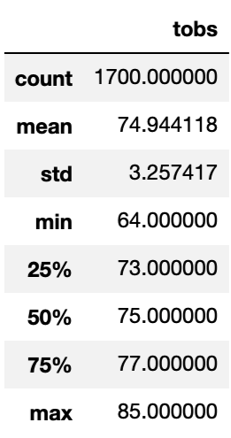
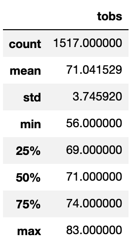

# Surfs Up with Advanced Data Storage and Retrieval 

## Overview of Project

* A Surf n' Shake shop in Hawaii needs investors.
* W. Avy, a famous investor, wants to see data analysis on weather data to ensure the shop will succeed.

### Purpose

* Perform data analysis on weather data.
* Specifically, concentrate the data analysis on June and December to see if the shop will be sustainable year-round. 

## Results

### June and December Weather Data

* June:

* December:

* Note: Column 'tobs' stands for Temperature Observations. 

### Weather Data Comparison

1. The Mean temperature for June (74.9 degrees) and December (71 degrees) are <4 degrees apart. 
2. The Median temperature for June (75 degrees) and December (71 degrees) are 4 degrees apart, which is similar to the difference in the Mean temperatures. 
3. The Max temperature for June is 85 degrees, and the Min temperature is 64 degrees. The Max temperature for December is 83 degrees, and the Min temperature is 56 degrees. 
 
## Summary

### Weather Data

1. The June and December weather data are similar. 
2. The similarity suggests that Surf n' Shake will be sustainable as a year-round business. 

### Additional Queries to Enhance the Weather Data

1. Conduct station analysis to see which station has the most temperature observations for June and December and to plot the data for this station

* Queries to identify the stations with the most temperature observations in June and December can be found in SurfsUp_Challenge.ipynb Cells 12 and 13
* Most active station in June: Tie between 'USC00519397', 'USC00519281', and 'USC00513117'
* Most active station in December: 'USC00519281'
* Queries to plot temperature observations for Station 'USC00519281' in June and December can be found in Cells 14 and 15

2. Conduct station analysis to see which station has the Max temperature for June and December 

* Queries to find the stations with the Max temperature for June and December can be found in Cells 16 and 17
* Station 'USC00511918' has the Max temp in June at 85.0 degrees.
* Station 'USC00516128' has the Max temp in December at 83.0 degrees.
